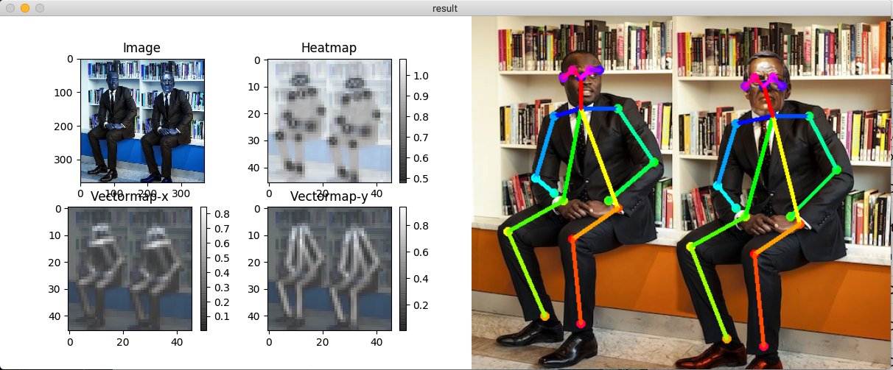

main components are based on https://github.com/ildoonet/tf-pose-estimation
Here the repo is revised to docker-based installation
All the required settings are defined in the Dockerfile

### Install

build docker image.
```
docker build . -t pose-image
docker run --runtime=nvidia -it -v $PWD:/usr/src/app --name tf-pose_app pose-image

```

inside the container, proceed building c++.

Build c++ library for post processing. See : https://github.com/ildoonet/tf-pose-estimation/tree/master/tf_pose/pafprocess
```
$ cd tf_pose/pafprocess
$ swig -python -c++ pafprocess.i && python3 setup.py build_ext --inplace
```


## Models & Performances

See [experiments.md](./etc/experiments.md)

### Download Tensorflow Graph File(pb file)

Before running demo, you should download graph files. You can deploy this graph on your mobile or other platforms.

- cmu (trained in 656x368)
- mobilenet_thin (trained in 432x368)
- mobilenet_v2_large (trained in 432x368)
- mobilenet_v2_small (trained in 432x368)

CMU's model graphs are too large for git, so I uploaded them on an external cloud. You should download them if you want to use cmu's original model. Download scripts are provided in the model folder.

```
$ cd models/graph/cmu
$ bash download.sh
```

## Demo

### Test Inference

You can test the inference feature with a single image.

```
$ python3 run.py --model=mobilenet_thin --resize=432x368 --image=./images/p1.jpg
```


The image flag MUST be relative to the src folder with no "~", i.e:
```
--image ../../Desktop
```
the resutl image will be saved as "resultimg.png" pafmap, heatmap, result and etc.



### Video

```
$ python3 run_video.py --model=mobilenet_thin --video=./etcs/dance.mp4
```

### Realtime Webcam

```
$ python3 run_webcam.py --model=mobilenet_thin --resize=432x368 --camera=0
```

Then you will see the realtime webcam screen with estimated poses as below. This [Realtime Result](./etcs/openpose_macbook13_mobilenet2.gif) was recored on macbook pro 13" with 3.1Ghz Dual-Core CPU.

## Python Usage

This pose estimator provides simple python classes that you can use in your applications.

See [run.py](run.py) or [run_webcam.py](run_webcam.py) as references.

```python
e = TfPoseEstimator(get_graph_path(args.model), target_size=(w, h))
humans = e.inference(image)
image = TfPoseEstimator.draw_humans(image, humans, imgcopy=False)
```

If you installed it as a package,

```python
import tf_pose
coco_style = tf_pose.infer(image_path)
```

## ROS Support

See : [etcs/ros.md](./etcs/ros.md)

## Training

See : [etcs/training.md](./etcs/training.md)

## References

See : [etcs/reference.md](./etcs/reference.md)
